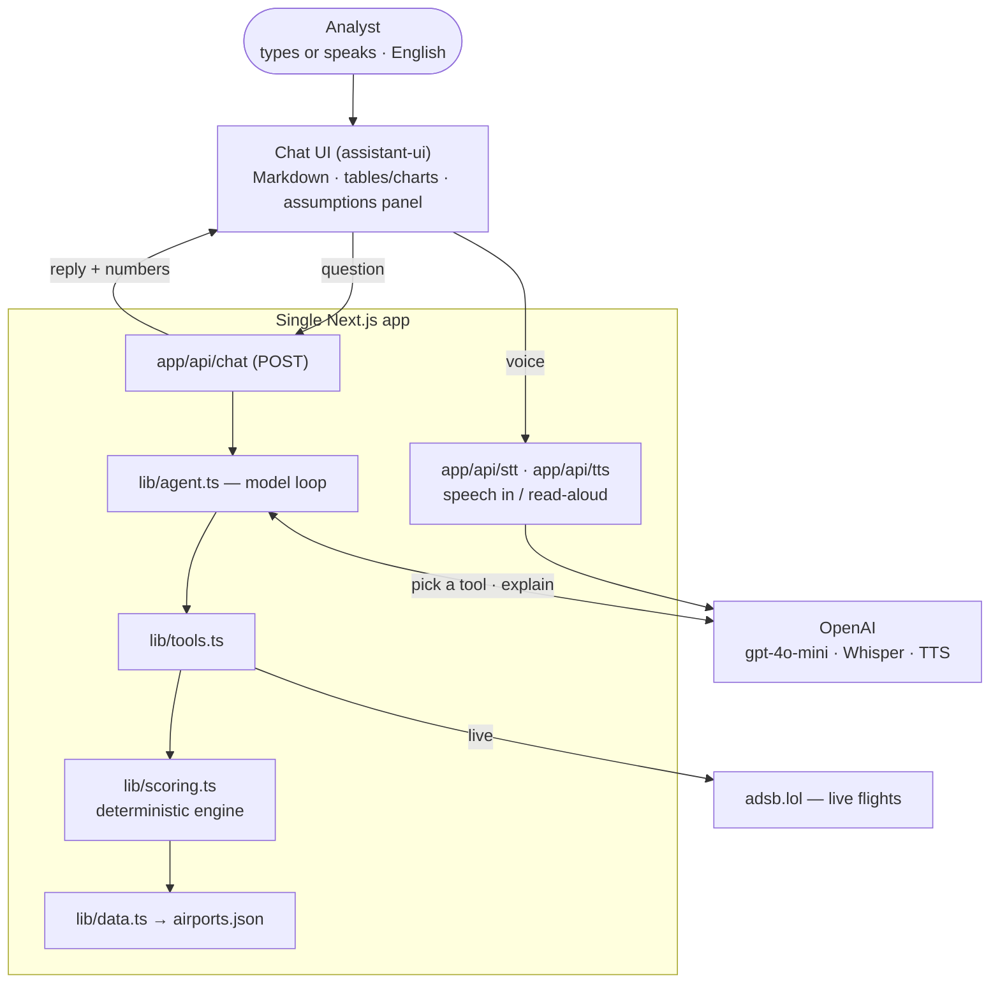

# Design & Architecture — Airport Investment Intelligence Agent

This is the design write-up for the agent that helps analysts find U.S. airports
where the demand-side case for a terminal expansion is strongest, i.e. where demand is growing
into the limits of what the airport can handle.

It walks through how the scoring works, the tradeoffs I made along the way, where the
AI actually sits in the system, and the data behind it all.

---

## 1. What it does

An analyst chats with the agent in natural language (typed or by voice) and asks
questions like:

| Question | How it's answered |
|---|---|
| Which New England airports are strong candidates for terminal expansion? | `rank_airports(scope="new_england", metric="expansion")` |
| Compare LA and Santa Ana congestion levels. | `compare_airports(["LAX","SNA"], metric="congestion")` |
| What % of flights out of Anchorage are long-haul? | `long_haul_breakdown("ANC")` |
| What is the unmet flight demand at SFO, and why? | `unmet_demand("SFO")` |

Every answer shows the natural-language explanation, a structured table/chart, and
an **assumptions & uncertainty** panel. It can also pull live data on request — asking
"how many flights are in the air near SFO right now" calls a live ADS-B API in real time.

---

## 2. Architecture

A **single Next.js (TypeScript) application**. The chat UI and the agent API live in
one codebase and deploy as one unit — the browser calls the app's own `/api` routes
(same-origin, no CORS, no separate backend to host). The app is **English-only**, in
both the typed and the voice paths.

The code is split into small layers, each with one job:

- `app/api/chat/route.ts` — the HTTP boundary. It validates the input, hands off to the
  agent, and always returns something the UI can render, even on error. It runs on the
  Node.js runtime because the OpenAI SDK needs it.
- `lib/agent.ts` — the model loop. This is the only file that talks to OpenAI; it
  handles language and orchestration and nothing else.
- `lib/tools.ts` — the tools the model is allowed to call. Every number the user sees
  comes from here.
- `lib/scoring.ts` — the scoring engine: plain functions, no I/O, no model.
- `lib/data.ts` — reads the bundled dataset (imported as JSON, so it works in any
  runtime without touching the filesystem).

Splitting it this way means `scoring.ts` and `data.ts` can be unit-tested on their own,
without the model in the loop, which is where the trust in the numbers comes from.

---

## 3. Scoring methodology

The scoring is deterministic — computed in code, not produced by the LLM. All scores
are **transparent weighted sums** of sub-metrics, each normalized to 0–1 against a
**fixed, documented reference scale** and reported on a 0–100 scale. Fixed scales
(rather than dataset-relative z-scores) mean a score means the same thing no matter
which airports are loaded, and results are stable and reproducible.

Reference anchors live in one place at the top of `lib/scoring.ts` (e.g. "30 min
average delay = fully congested", "10% YoY growth = maximal demand signal"). Every
weight is one edit away from being challenged and re-tuned.

### 3.1 Congestion index (0–100)

Operational strain, judged as **rates** so large hubs and small airports are
comparable:

| Component | Weight | Reference (maps to 1.0) |
|---|---|---|
| Share of departures delayed >15 min | 0.35 | 35% |
| Average departure delay | 0.30 | 30 min |
| Cancellation rate | 0.15 | 5% |
| Load-factor pressure | 0.20 | 90% load (floor 70%) |

### 3.2 Long-haul mix

Not a score but a breakdown: share of **departures** by great-circle distance —
short (<1,100 mi), medium (1,100–2,200), long (>2,200). These shares are estimates
(see §5 on data sources).

### 3.3 Unmet-demand proxy (0–100)

"Unmet demand" is not directly measurable in free data, so it's an explicit
**composite lower-bound proxy**:

| Driver | Weight | Rationale |
|---|---|---|
| Load-factor pressure | 0.40 | Sustained high seat use ⇒ demand supply can't absorb |
| Congestion | 0.35 | Delay/throughput gap ⇒ demand above capacity |
| Growth vs. capacity | 0.25 | Fast growth against fixed runways ⇒ widening gap |

### 3.4 Expansion attractiveness (0–100) — the headline demand-side score

The thesis: the demand-side case for expansion is strongest where **strong, growing
demand meets a capacity-constrained airport**, so renovation unlocks revenue rather
than adding idle space. This is a **demand-side opportunity** score, not a
profitability estimate — it deliberately doesn't model construction cost, land/gate
availability, or financing (see §6).

| Component | Weight | Why it matters to the investment |
|---|---|---|
| Demand growth | 0.30 | Future demand to justify the build |
| Congestion | 0.30 | Strain today that expansion would relieve |
| Load-factor pressure | 0.25 | Seats already scarce |
| Passenger volume upside | 0.15 | Scale of travelers who benefit |

---

## 4. Where and how AI is used

The short version: the model handles language, the code handles numbers.

The model (OpenAI's `gpt-4o-mini`) reads the analyst's question, works out which tool
to call and with what arguments, keeps track of the conversation for follow-ups, and
explains the results in plain prose. That's it. Every metric, ranking, and score comes
from the scoring engine, and so does the assumptions and uncertainty text.

This is deliberate. The assumptions, the caveats, and the numbers in the table are all
pulled from the code, not written by the model (`lib/agent.ts` gathers them from each
tool call). A confused model reply might be unhelpful, but it can't quietly invent a
figure or drop a caveat, because it never had its hands on the numbers in the first
place. The loop is also capped (`MAX_AGENT_STEPS`) so it can't run away.

---

## 5. Data sources

The dataset is built by a script (`scripts/build-dataset.mjs`, run with
`npm run build:data`) that pulls from public sources and writes `data/airports.json`.
The app then reads that file — it doesn't hit these sources on every request, which
would be pointless since the underlying data updates at most yearly.

| Field | Source | How |
|---|---|---|
| Name, city, state, coordinates, runways | **OurAirports** (public domain) | fetched live by the build script |
| Passengers and departures (2024, domestic) | **BTS T-100 Domestic** via the USDOT NTAD **ArcGIS API** | a real queryable JSON API — no download |
| Load factor, delays, cancellations, haul mix, YoY growth | representative **estimates** | no free per-airport API exposes these |

So the passenger and departure numbers are the real 2024 figures, and the reference
details are real; the rest are honest estimates, flagged as such in the dataset's
metadata. The one caveat worth stating: the ArcGIS layer is **domestic** T-100, so
passenger counts don't include international traffic (an international-heavy hub like
SFO looks smaller than its true total). Getting seats, per-segment distance, and
delays would mean parsing BTS's multi-gigabyte bulk files, which wasn't worth it here.

The estimated fields are the honest soft spot of this prototype: congestion and
expansion both lean on delays and load factor, which are currently estimates. The
important part is that this is an **architecture and methodology** — swapping those
estimates for the real feeds (BTS On-Time for delays, T-100 Segment for seats and
distance, FAA ASPM for demand-vs-capacity) is a change to `build-dataset.mjs` only.
The scoring engine, the tools, and the contract don't change, because they read the
same fields regardless of where the numbers came from.

There's also a **live** source: the adsb.lol community ADS-B API, called at request
time by the `live_flights` tool for "what's in the air near this airport right now."
(An earlier version used OpenSky, but OpenSky's server refuses connections from cloud
datacenter IPs, so it can't be reached from Vercel; adsb.lol is CDN-fronted and free
with no key.)

---

## 6. Key tradeoffs

- **Single Next.js app (one language) vs. a separate Python service.** Folding the
  agent into TypeScript route handlers makes it one codebase that deploys to Vercel in
  one click, with the API served same-origin (no CORS, no second host). *Tradeoff:* we
  don't run a separate Python backend, but we gain a dramatically simpler, more
  reliable deployment.
- **Curated snapshot vs. live ingestion.** A full BTS pipeline (gigabytes of CSVs)
  would be over-engineering at this stage and adds fragility. We bundle a validated
  snapshot and document the scale-up path. *Tradeoff:* data isn't real-time (BTS
  itself lags 1–2 months anyway).
- **Fixed reference scales vs. dataset-relative normalization.** Fixed scales give
  stable, portable, explainable scores. *Tradeoff:* the anchors are judgment calls;
  they're centralized and documented so they can be tuned.
- **Deterministic numbers vs. letting the model summarize.** Assumptions and figures
  come from code. *Tradeoff:* the answers are a little less free-flowing than a
  pure-model reply, but you can audit every number, which matters when people act on them.
- **Demand-side scoring vs. full investment model.** Scores reflect demand
  opportunity, not construction cost, land/gate availability, or noise curfews.
  Kept out to stay clear and honest rather than pretend precision.
- **Cloud speech (OpenAI) vs. the browser's built-in speech.** We record audio and use
  OpenAI Whisper to transcribe questions and OpenAI TTS to read answers back. *Why:* the
  browser's built-in voices are robotic and its recognition is less accurate for accented
  speech; Whisper transcribes well and the neural voices sound natural. *Tradeoff:* a small
  per-use cost (fractions of a cent) and a server round-trip, versus the browser's
  free-but-worse option.

---

## 7. Assumptions, uncertainty & scoping (stated plainly)

- **Scope:** ~28 major and selected mid-size U.S. airports — enough to answer the
  questions above credibly; not every U.S. airport.
- **Vintage:** a single recent full-year snapshot; no intra-year seasonality.
- **Congestion** mixes weather with true capacity saturation; annual averages smooth
  out peak-day spikes.
- **Unmet demand** is a lower-bound proxy — bookings that never happened (priced-out
  or sold-out demand) aren't in free data; that needs proprietary GDS/OAG/Cirium.
- **Expansion score** is demand-side only, as noted above.

These are surfaced to the user on every answer, not buried here.

---

## 8. Where I'd take it next

- Multi-year BTS trends so growth and seasonality come from real data, not an estimate
  (the current build uses a single year).
- International T-100 and the On-Time delay tables, so passenger totals and delays are
  real too, not just the domestic figures and estimated delays.
- FAA ASPM demand-vs-capacity ratios for a stronger congestion/unmet signal.
- The cost side of the investment case (capex, gate/land constraints) to turn the
  demand score into a true ROI ranking.
- A small map view using the coordinates already in the dataset.
